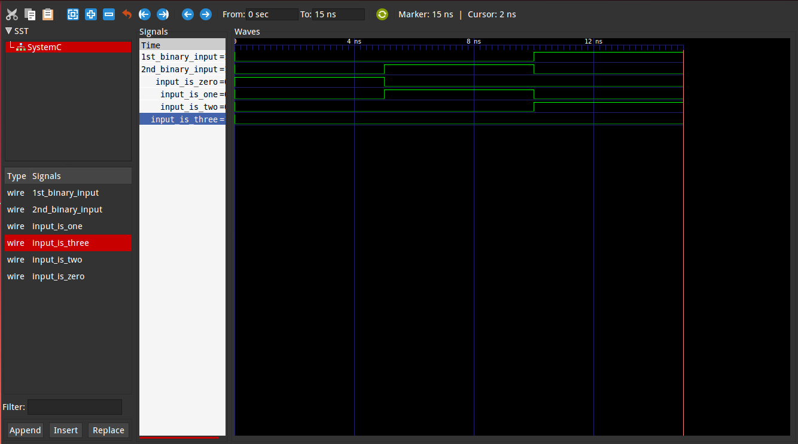

 Dennis Mabuka 

 I39/2464/2014 

REPORT ON 2BY4DECODER

 INTRODUCTION 

A line decoder is a device that changes the input code into a set of signals. 
It takes an n-digit binary number and decodes it into 2n data lines.
It does the reverse of encoding.  

The following truth able below was used as aguide line

  

The representation of the circuit  used is as shown below

Circuit:

  

The Model Of Computation used is :

  

Results:
The above MOC was implemented in systemc (code in this folder) and the following output found from traced signals. 
Traced signals timing diagram:

  

Terminal results are:

  

