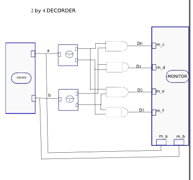
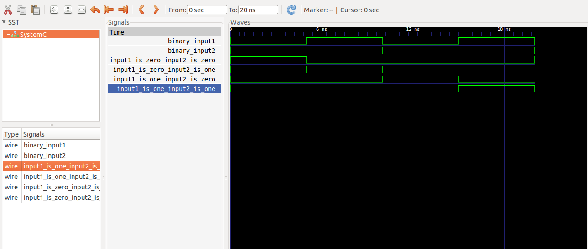

This is a 2-by-4 decoder example, which is a makefile project and so no need for an IDE. 
Just cd into this folder and run the command 

    make decoder

A line decoder is a device that changes the input code into a set of signals. 
It takes an n-digit binary number and decodes it into 2n data lines.
It does the reverse of encoding.  
In the following truth table, only the output D0 is high when the inputs are zero,the output D1 is high when input A1 is 0 and A0 is 1,the output D2 is high when input A1 is 1 and A0 is 0 and the output D3 is high when both the inputs A1 and A0 are 1. It decodes a two digit binary number.
  
Its truth table: 

  

Circuit:

  

Model of computation:

  

Results:
The above MOC was implemented in systemc (code in this folder) and the following output found from traced signals. 
Traced signals timing diagram:

  

Tutorial 2:
Create a decoder_2by4 based on this decoder_1by2. 
hint: systemc modules can be cascaded to build more complex modules.
