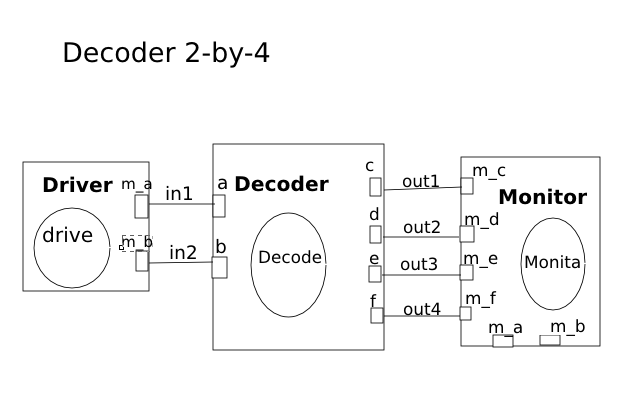
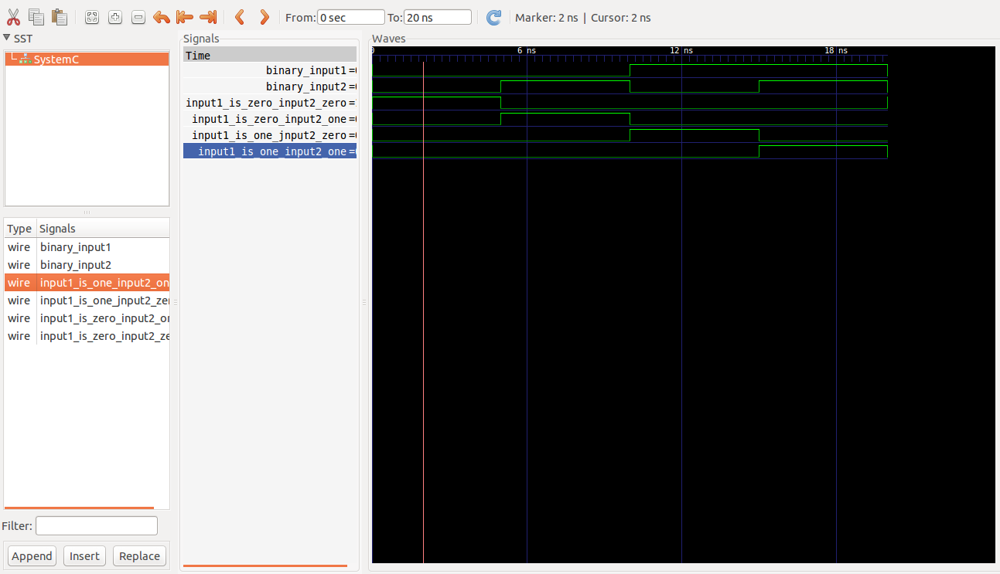

This is a 2-by-4 decoder example, which is a makefile project and so no need for an IDE. 
Just cd into this folder and run the command 

    make decoder

A line decoder is a device that changes the input code into a set of signals. 
It takes an n-digit binary number and decodes it into 2n data lines.
It does the reverse of encoding.  
In the following truth table, only the output D0 is high when both inputs are zero, the output D1 is only high when input A0 is 1  and input A1 is zero. Output D2 is only high when A1 is 1 and A0 is zero and output D3 is only high when both inputs A0 and A1 are 1.  it decodes a two digit binary numbers.

Its truth table: 

  

d_a=0; d_b=0;
		wait(5,SC_NS);
		d_a=0; d_b=1;
		wait(5,SC_NS);
        d_a=1; d_b=0;
		wait(5,SC_NS);
		d_a=1; d_b=1;
		wait(5,SC_NS)

Circuit:

  

Model of computation:

  

Results:
The above MOC was implemented in systemc (code in this folder) and the following output found from traced signals. 
Traced signals timing diagram:

  

