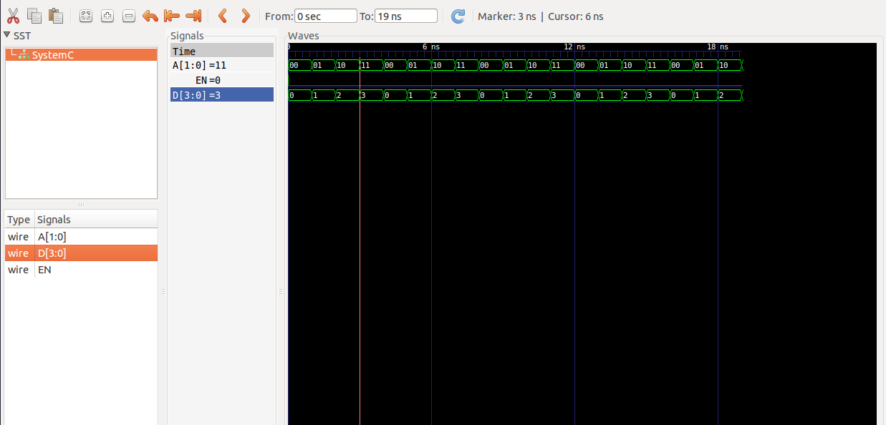

<html>
Tutorial 2:
Example of cascading decoder.

Open a terminal and just cd into this folder and run the command 

    make decoder

A line decoder is a device that changes the input code into a set of signals. 
It takes an n-digit binary number and decodes it into 2n data lines.
Decoding does the reverse of encoding.  

2-by-4 decoder decodes 2 digit binary numbers. 
This 2-by-4 decoder is made using 1-by-2 decoder where by when an ENABLE is low, A0=0 and A1=0 and
the output D0=00, when A0=0 and A1=1 the output D1=01, when A0=1 and A1=0 the output D2=10
and when A0=1 and A1=1 the output D3=11. 

Its?

  

Circuit:

  

Model of computation:

  

Results:
The above MOC was implemented in systemc (code in this folder) and the following output found from traced signals. 
Traced signals timing diagram:

  

</html>
