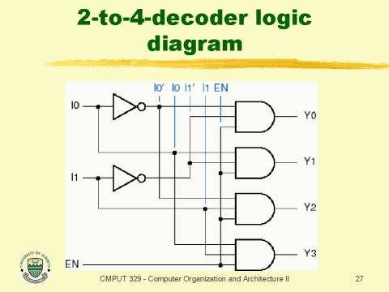

## A 2 by 4 Decoder

A **decoder** is a circuit that changes a code into a set of signals. It is called a decoder because *it does the reverse of encoding*, this circuit takes an *n-bit* binary number and produces an output on one of *2 n* output lines .In this case this decoder takes two inputs and produces four inputs by using a combination of NOT and AND gates.

Photo courtsey of [ualberta](https://webdocs.cs.ualberta.ca/~amaral/courses/329/webslides/Topic8-DocTimeDiagrams/img027.gif)