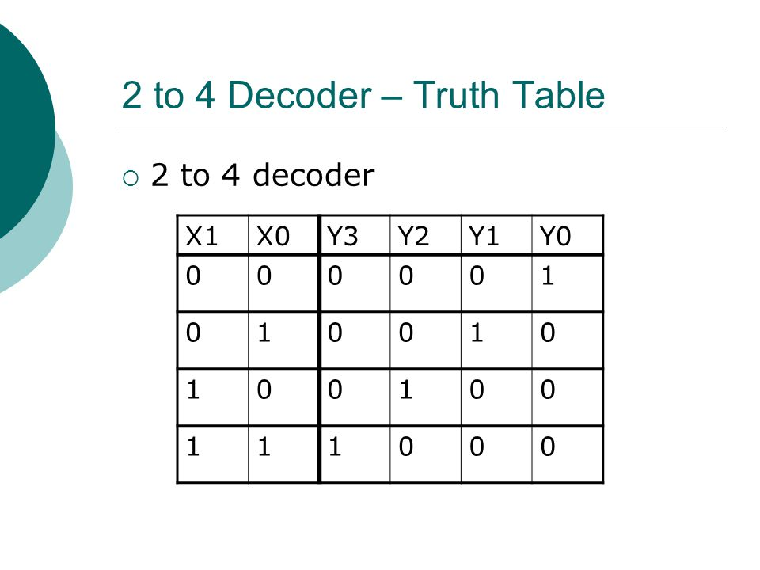
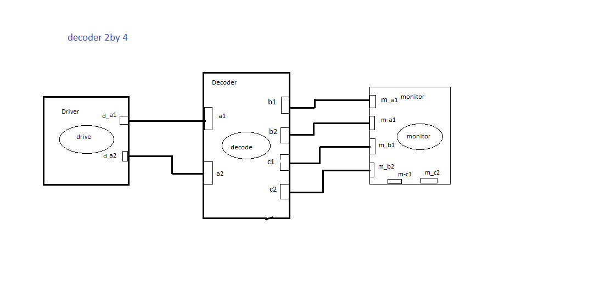
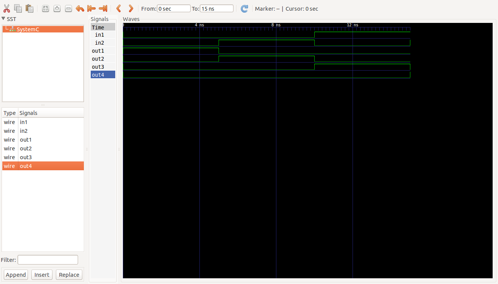

KELVIN GITAU MWANGI
I39/2470/2014

                       SPH 336 REPORT::2BY4DECODER
  
INTRODUCTION

This is a 2-by-4 decoder example, which is a makefile project and so no need for an IDE. 
Just cd into this folder and run the command 

A line decoder is a device that changes the input code into a set of signals. 
It takes an n-digit binary number and decodes it into 2n data lines.
It does the reverse of encoding.  

In the following truth table, only the output Y0 is high when BOTH inputs are zero, and the output Y1 is high when the input is X0 is high,Y2 is high when input x1 is high and Y3 is high when BOTH inputs are high. it decodes a single digit binary number.
  

Its truth table: 

  

Circuit:

  

Model of computation:

  

Results:
The above MOC was implemented in systemc (code in this folder) and the following output found from traced signals. 
Traced signals timing diagram:

  

results of the terminal after calling the command make all is in the terminal picture

