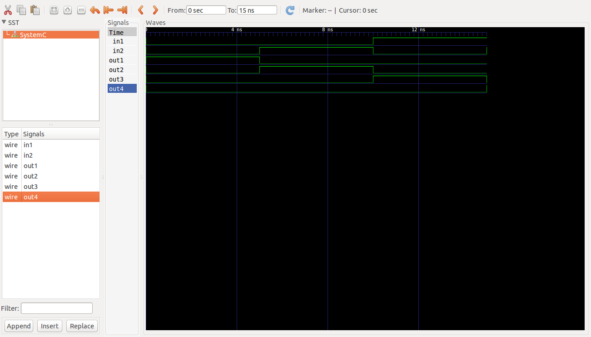
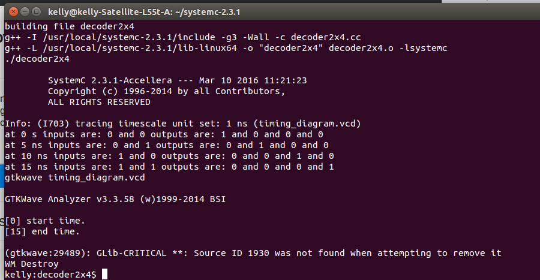

I39/3485/2009
KELVIN MGENDI MAFUSA

		<h2>DECODER 2 BY 4 </h2> 
Introduction

The project involved implementing a 2 by 4 decoder from  a 1 by 2 decoder by extending the systemc modules.

A decoder is a device thta changes the input code into  a set of signals.

It takes a  n-input of binary nature and decodes it into a set of signals (2 data lines).

It does the reverse of encoding.  

In the following truth table, only the output Y0 is high when BOTH inputs are zero, and the output Y1 is high when the input is X0 is high,Y2 is high when input x1 is high and Y3 is high when BOTH inputs are high. it decodes a single digit binary number.

Its truth table: 

  

Circuit:

  

Model of computation:

  

Results:
The above MOC was implemented in systemc (code in this folder) and the following output found from traced signals. 
Traced signals timing diagram:

  

results of the terminal after calling the command make all is in the terminal picture

