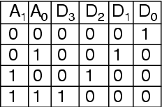

Name : Agatha Doreen Leonards
reg no :i39/2474/2014
 
A 2 by 4 decoder takes two inputs and produces 4 outputs.
It is normally made by combining 2 1 by 2 decoders.

Its truth table: 

  

Circuit:

  

Model of computation:

  

